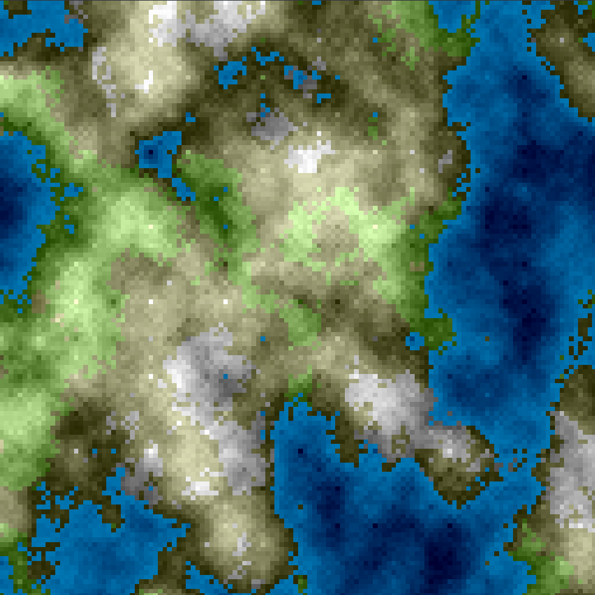
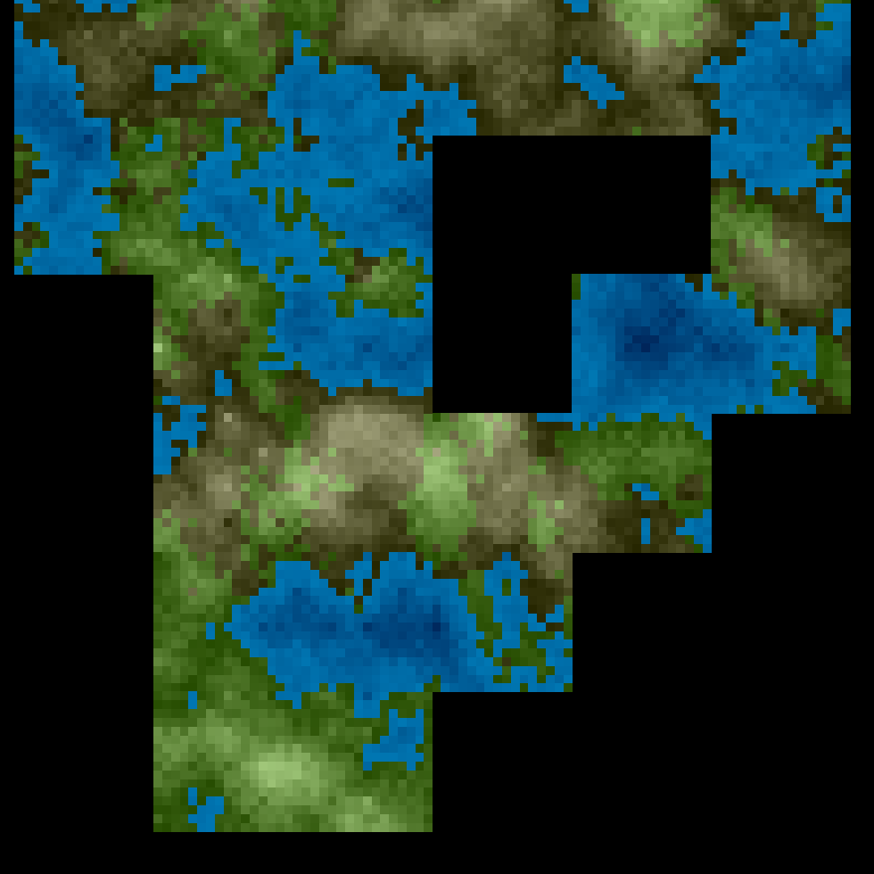

# PythonHeightMap

implementation of the diamond square algorithm to generate a height map and a biome map

### Requirements

```python3 -m pip install -r requirements.txt```

### Viewer : Generate static chunks

```python3 height_map_generator/viewer.py [depth] [coef]```
  * `depth` number of occurrences of the algorithm (starts to be very long from 8)
  * `coef` maximum height difference between two blocks side by side

While the window is open you can use :
  * `p` to smooth the chunk
  * `u` enable/disable the coloration by height
  * `i` enable/disable the coloration by biome



### Discover : Generate a world

```python3 height_map_generator/discover.py [depth] [coef]```
  * `depth` number of occurrences of the algorithm (starts to be very long from 8)
  * `coef` maximum height difference between two blocks side by side
  
While the window is open you can use :
  * `directional arrows` to move around the map and generate a new chunk
  * `p` to smooth all the chunks
  * `m` to regenerate the current chunk
  * `u` enable/disable the coloration by height
  * `i` enable/disable the coloration by biome
  
  
  
  ### TODO
  
  * rework the display system
  * reword code to upgrade general performances
  * add a seeding system
  * save the current window to an image
